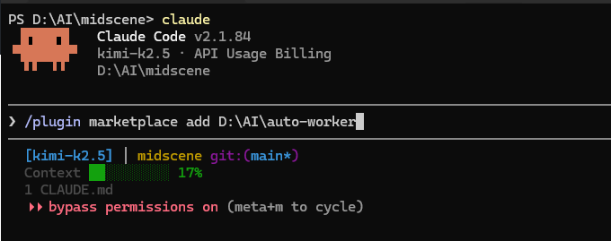
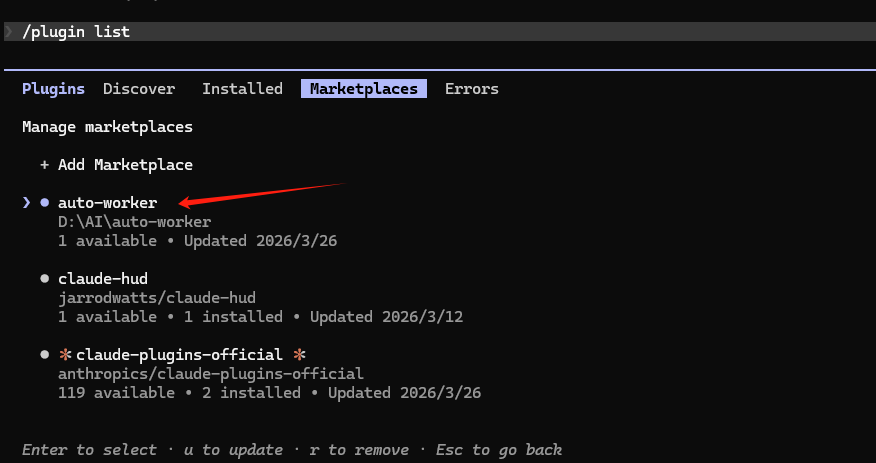
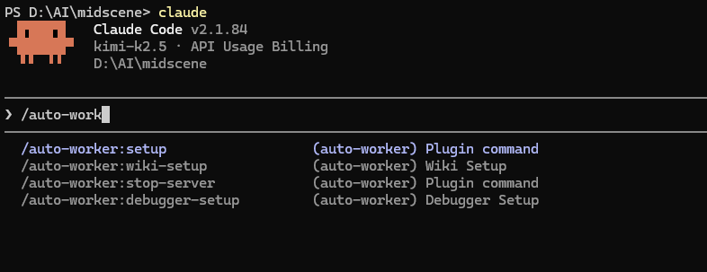

# Auto Worker 使用教程

## 步骤1：下载 Auto Worker

将 auto-worker 项目下载到你的本地目录，例如：

```bash
D:\AI\auto-worker
```

## 步骤2：设置插件市场

启动 Claude Code，然后添加插件市场路径：

```bash
claude
```

```bash
/plugin marketplace add <path>
```

> **注意**：`<path>` 需要替换为你下载后的插件**绝对路径**

执行示例：



```bash
/plugin marketplace add D:\AI\auto-worker
  ⎿  Successfully added marketplace: auto-worker
```

## 步骤3：安装插件

1. **重启 Claude Code**（安装前必须先重启）

2. 在 Claude 中输入以下命令查看可安装的插件：

```bash
/plugin list
```

3. 切换到 **Marketplaces** 标签页，你应该能看到 `auto-worker` 插件列表



4. 选择插件并安装

## 步骤4：验证安装

1. **再次重启 Claude Code**

2. 输入 `auto-work` 查看命令是否生效，你应该能看到以下可用命令：



```
/auto-worker:setup        - Plugin command
/auto-worker:wiki-setup    - Wiki Setup
/auto-worker:stop-server   - Plugin command
/auto-worker:debugger-setup - Debugger Setup
```

如果看到这些命令，说明插件安装成功！

---

## 可用命令说明

| 命令 | 说明 |
|------|------|
| `/auto-worker:setup` | 初始化设置 |
| `/auto-worker:wiki-setup` | Wiki 文档系统设置 |
| `/auto-worker:stop-server` | 停止服务 |
| `/auto-worker:debugger-setup` | 调试器设置 |
