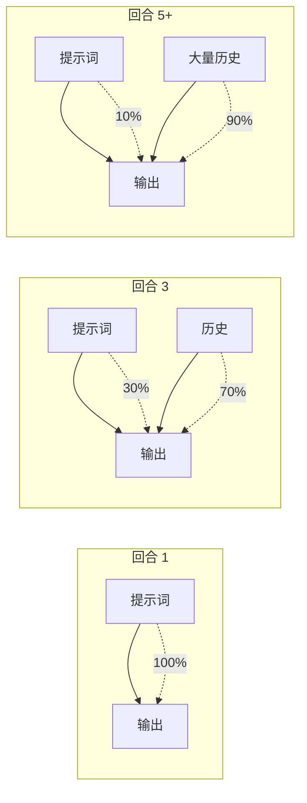

# Skill 与普通提示词的区别

> 提示词优化原则在 Skill 和普通提示词上的应用有重要差异。

---

## 核心差异

| 特性 | Skill | 普通提示词 |
|------|-------|-----------|
| **description** | ✅ 有，始终可见 | ❌ 没有 |
| **注意力衰减** | 有 description 兜底 | 无兜底，完全依赖提示词本身 |
| **复用性** | 多次触发 | 一次性 |
| **上下文压缩** | 核心规则在 description 中保留 | 整体被压缩 |

---

## 重要性排序对比

### Skill

| 排序 | 原则 | 重要性 | 原因 |
|------|------|--------|------|
| 1 | 解释"为什么" | ⭐⭐⭐ | 根本解决，让模型理解意图 |
| 2 | 正面指令 | ⭐⭐⭐ | 直接有效，告诉做什么 |
| 3 | description 包含核心规则 | ⭐⭐ | 兜底保护，始终可见 |
| 4 | 渐进式提示 | ⭐ | 补救措施，有 description 可减少 |
| 5 | 内容精简 | ⭐ | 基础要求 |

### 普通提示词

| 排序 | 原则 | 重要性 | 原因 |
|------|------|--------|------|
| 1 | 解释"为什么" | ⭐⭐⭐ | 唯一能对抗注意力稀释的方法 |
| 2 | 正面指令 | ⭐⭐⭐ | 直接有效，告诉做什么 |
| 3 | 渐进式提示 | ⭐⭐ | 没有兜底，这是唯一补救 |
| 4 | 内容精简 | ⭐ | 基础要求 |

---

## 为什么普通提示词更依赖"解释为什么"

### 问题：注意力稀释



### Skill 的防御

```
提示词被稀释 → description 在系统提示中仍然可见 → 核心规则不丢失
```

### 普通提示词的困境

```
提示词被稀释 → 没有兜底 → 模型可能忘记规则
```

### 唯一解法：让模型理解意图

```markdown
❌ 必须使用 HTTP fetch，禁用 console.log

✅ 使用 HTTP fetch，这样日志会发送到独立服务，便于追踪。
   console.log 会被浏览器控制台的其他日志淹没。
```

模型理解了"为什么"，即使规则被压缩，它仍然知道**意图**。

---

## 渐进式提示的差异

### Skill：可选

description 已包含核心规则，渐进式提示可以减少：

```markdown
## 步骤 1
...完整规则...

## 步骤 2
...（简短提醒即可）
```

### 普通提示词：必须

没有 description 兜底，必须在每个使用点重复关键规则：

```markdown
## 步骤 1
使用 HTTP fetch 发送日志...

## 步骤 2
**如需添加更多埋点**：用 HTTP fetch（前端）或文件写入（后端）。

## 步骤 3
**埋点方式**：前端用 HTTP fetch，后端用文件写入。
```

---

## 实战建议

### 写 Skill 时

1. **description 必须包含核心规则**（最重要的一条约束）
2. 解释"为什么"让模型理解意图
3. 渐进式提示可精简

### 写普通提示词时

1. **开头就解释"为什么"**（让模型理解意图）
2. **每个步骤重复关键规则**（渐进式提示更重要）
3. 用正面指令，避免负面清单

---

## 核心公式

### Skill

```
质量 = 解释原因 × 正面指令 + description兜底
```

### 普通提示词

```
质量 = 解释原因 × 正面指令 × 渐进提示
```

---

## 一句话总结

> **解释"为什么"和正面指令是通用的核心，Skill 有 description 兜底可减少渐进提示，普通提示词必须靠渐进提示补救。**