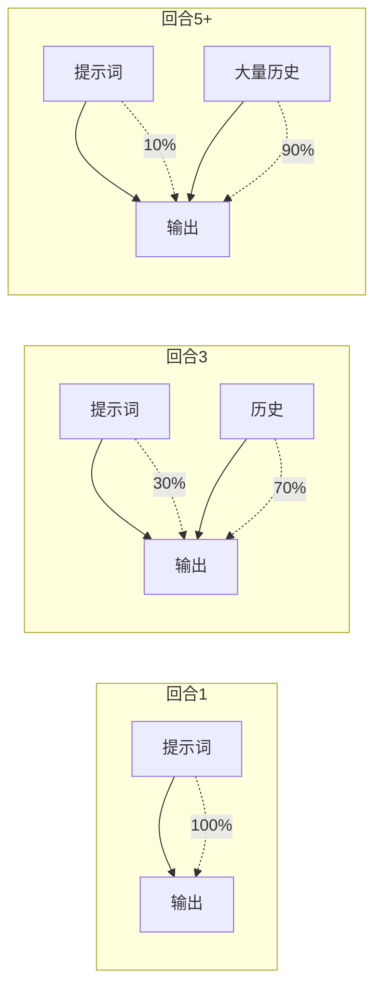
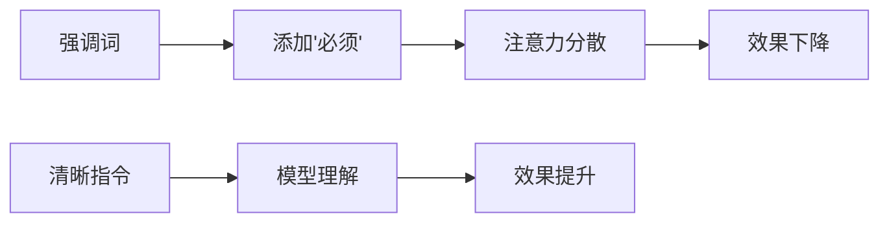
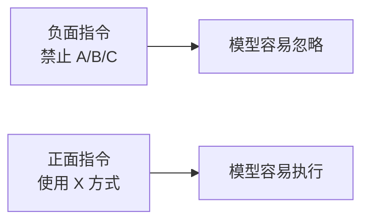
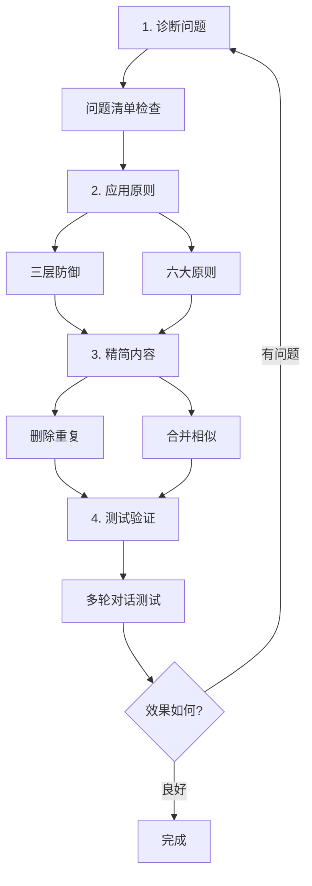

# 提示词优化指南

> 一套可复用的提示词优化方法论，适用于任何 AI 提示词的优化。

---

## 一、诊断问题

### 1.1 常见问题清单

优化前，先对照检查你的提示词是否存在以下问题：

| 问题类型 | 症状 | 原因 |
|---------|------|------|
| **臃肿冗余** | 同一配置重复多次 | 担心模型忘记 |
| **过度强调** | 大量"必须""严禁""⚠️" | 不信任模型 |
| **负面指令多** | 大篇幅写"禁止做什么" | 防御性思维 |
| **结构混乱** | 规则散落各处 | 缺乏整体设计 |
| **缺少原因** | 只有"必须"没有"为什么" | 模型无法理解意图 |
| **依赖引用** | 关键信息在外部文件 | 多轮对话后丢失 |

### 1.2 核心洞察：注意力稀释



**关键发现**：即使上下文未被截断，提示词的影响力也会随对话变长而下降。模型更关注最近的内容。

---

## 二、优化策略

### 2.1 三层防御体系

<svg viewBox="0 0 600 280" xmlns="http://www.w3.org/2000/svg"><defs><linearGradient id="g1" x1="0%" y1="0%" x2="0%" y2="100%"><stop offset="0%" style="stop-color:#e74c3c;stop-opacity:0.2"/><stop offset="100%" style="stop-color:#e74c3c;stop-opacity:0.05"/></linearGradient><linearGradient id="g2" x1="0%" y1="0%" x2="0%" y2="100%"><stop offset="0%" style="stop-color:#f39c12;stop-opacity:0.2"/><stop offset="100%" style="stop-color:#f39c12;stop-opacity:0.05"/></linearGradient><linearGradient id="g3" x1="0%" y1="0%" x2="0%" y2="100%"><stop offset="0%" style="stop-color:#27ae60;stop-opacity:0.2"/><stop offset="100%" style="stop-color:#27ae60;stop-opacity:0.05"/></linearGradient></defs><rect x="10" y="10" width="580" height="260" rx="10" fill="url(#g1)" stroke="#e74c3c"/><text x="30" y="35" font-size="12" font-weight="bold" fill="#c0392b">第一层：系统级（始终可见）</text><text x="30" y="55" font-size="10" fill="#666">位置：description / 系统提示</text><text x="30" y="70" font-size="10" fill="#666">内容：最核心的一句规则</text><rect x="30" y="90" width="540" height="160" rx="8" fill="url(#g2)" stroke="#f39c12"/><text x="50" y="115" font-size="12" font-weight="bold" fill="#d68910">第二层：配置级（开头定义）</text><text x="50" y="135" font-size="10" fill="#666">位置：提示词开头</text><text x="50" y="150" font-size="10" fill="#666">内容：完整配置、代码模板</text><rect x="50" y="170" width="500" height="60" rx="6" fill="url(#g3)" stroke="#27ae60"/><text x="70" y="195" font-size="12" font-weight="bold" fill="#1e8449">第三层：渐进级（关键点重复）</text><text x="70" y="215" font-size="10" fill="#666">位置：每个使用点</text><text x="170" y="215" font-size="10" fill="#666">内容：简短的关键规则提醒</text></svg>

| 层级 | 位置 | 放什么 | 为什么 |
|------|------|--------|--------|
| 第一层 | description / 系统提示 | 最核心的一句规则 | 始终可见，不受对话长度影响 |
| 第二层 | 提示词开头 | 完整配置、模板 | 一次定义，结构清晰 |
| 第三层 | 每个使用点 | 简短的关键规则提醒 | 对话变长时保持可见 |

### 2.2 六大优化原则

#### 原则 1：相信模型智能



| 错误 | 正确 |
|------|------|
| ⚠️ 必须调用！严禁不调用！ | 每次回复末尾，用 X 工具询问用户。 |
| 这是强制规则！不调用会出错！ | 完成后用 Y 方式处理。 |

#### 原则 2：结构 > 强调

用结构表达关系，而非用强调词。


这比"⚠️ 必须按顺序执行！严禁跳步！"更有效。

#### 原则 3：渐进式提示

**最重要原则**：

| 内容类型 | 处理方式 |
|---------|---------|
| 完整配置 | 开头定义一次 |
| 关键规则 | 每个使用点简短提醒 |

```markdown
## 开头
AskUserQuestion({完整配置...})

## 步骤 1
...执行任务...
**完成后用 AskUserQuestion 询问下一步。**

## 步骤 2
...执行任务...
**完成后用 AskUserQuestion 询问下一步。**
```

#### 原则 4：解释"为什么"

| 错误 | 正确 |
|------|------|
| 严禁创建辅助函数！ | 每个代码块独立，便于一键清理。 |
| 禁止使用 X 方式！ | 使用 Y 方式，因为它能保证 Z。 |

#### 原则 5：正面指令



| 避免 | 推荐 |
|------|------|
| 禁止使用 console.log | 使用 HTTP fetch 发送日志 |
| 不要创建共享函数 | 每个埋点使用独立代码块 |

#### 原则 6：定期清理

每次优化后，问自己：

- [ ] 这条规则在重复吗？
- [ ] 能用结构代替吗？
- [ ] 解释了原因吗？
- [ ] 是负面指令吗？
- [ ] 真的需要吗？

---

## 三、优化流程

### 3.1 标准优化步骤



### 3.2 优化检查清单

**诊断阶段**：

- [ ] 识别重复内容（同一配置出现几次？）
- [ ] 统计强调词数量（"必须""严禁"出现几次？）
- [ ] 检查负面指令比例（"禁止"占比多少？）
- [ ] 检查结构是否清晰（能否画成流程图？）

**优化阶段**：

- [ ] 核心规则是否放入第一层（description）？
- [ ] 完整配置是否只在开头定义一次？
- [ ] 关键规则是否在每个使用点有简短提醒？
- [ ] 是否用正面指令替代了负面指令？
- [ ] 是否解释了"为什么"？
- [ ] 是否用结构替代了强调？

**验证阶段**：

- [ ] 多轮对话测试（5+ 回合后规则是否仍然有效？）
- [ ] 边界情况测试（模型是否能正确判断？）
- [ ] 行数对比（优化后是否精简？）

---

## 四、实战模板

### 4.1 提示词结构模板

```markdown
---
name: skill-name
description: |
  一句话说明功能。

  核心规则：[最关键的一条规则]。

  触发场景：[什么时候使用]。
---

# Skill 名称

**流程**：步骤 A → 步骤 B → 步骤 C

---

## 核心配置

[完整的配置、模板、JSON 等]

---

## 步骤 1：XXX

[步骤说明]

**完成后**：[简短的关键规则提醒]

---

## 步骤 2：XXX

[步骤说明]

**完成后**：[简短的关键规则提醒]

---

## 步骤 3：XXX

[步骤说明]
```

### 4.2 快速优化对照表

| 问题 | 解决方案 | 示例 |
|------|---------|------|
| 重复 5 次 | 定义 1 次 + 渐进提醒 | 开头定义完整配置，各步骤简短提醒 |
| 大量"必须" | 改为清晰指令 | "每次调用 X" 而非 "必须调用 X！" |
| 负面指令多 | 改为正面指令 | "使用 X" 而非 "禁止 Y" |
| 没解释原因 | 加"为什么" | "使用 X，因为能保证 Y" |
| 结构混乱 | 用流程图 | `步骤1 → 步骤2 → 步骤3` |
| 对话长后失效 | 三层防御 | description + 开头配置 + 渐进提醒 |

---

## 五、常见场景

### 场景 1：模型忘记调用某个工具

**原因**：规则只在开头出现，对话变长后影响力下降。

**解决**：
1. 在 description 加核心规则
2. 在每个使用点加简短提醒

### 场景 2：模型自作主张改变行为

**原因**：没有解释"为什么"，模型不理解边界。

**解决**：
1. 解释原因而非只说"必须"
2. 用正面指令明确正确行为

### 场景 3：提示词越来越长

**原因**：遇到问题就加规则，不断打补丁。

**解决**：
1. 定期清理，删除重复
2. 用结构替代文字
3. 合并相似规则

---

## 六、总结

### 核心公式

```
提示词效果 = 信任模型 + 清晰结构 + 渐进式提示
```

### 优化口诀

| 原则 | 口诀 |
|------|------|
| 相信智能 | 少强调 |
| 结构优先 | 用流程图 |
| 渐进提示 | 关键点重复 |
| 解释原因 | 告诉为什么 |
| 正面指令 | 说做什么 |
| 定期清理 | 删除冗余 |

### 核心心法

> 把模型当成聪明的同事，而不是需要反复叮嘱的孩子。
>
> 但多轮对话会遗忘，关键规则需要在关键位置重复出现。

---

## 附录：完整检查清单

**每次优化必查**：

- [ ] description 是否有核心规则？
- [ ] 完整配置是否只定义一次？
- [ ] 关键规则是否渐进提醒？
- [ ] 是否用正面指令？
- [ ] 是否解释了原因？
- [ ] 是否用结构代替强调？
- [ ] 是否删除了冗余？
- [ ] 行数是否精简？
- [ ] 是否经过多轮对话测试？