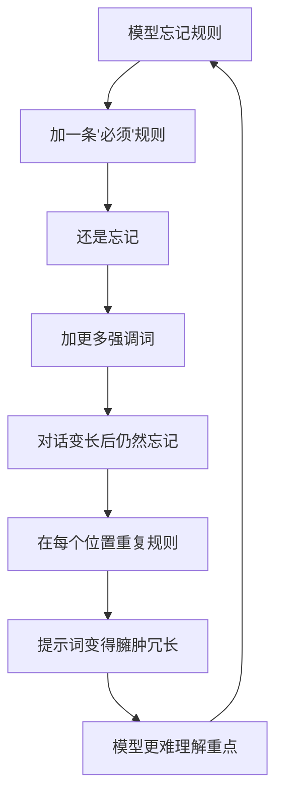
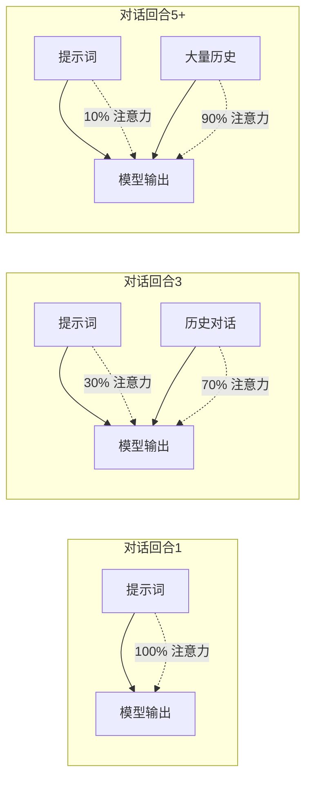
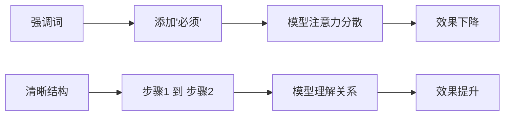
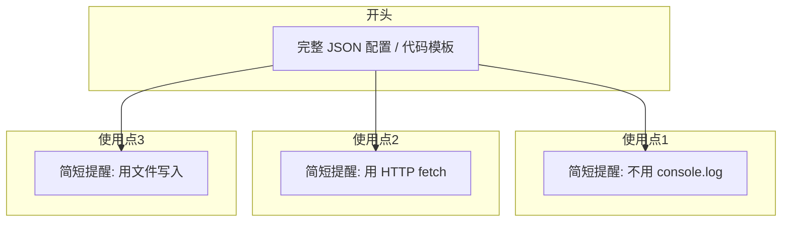

# 提示词工程：从堆砌规则到精准引导

> 本文记录了在优化 Debugger Skill 提示词过程中的思考与发现，总结了提示词工程的核心方法论。

---

## 一、问题的本质

### 1.1 "打补丁"式写作

大多数人在写提示词时，会陷入一个恶性循环：



**根本原因**：用"堵"的方式解决问题，而不是找到根本原因。

### 1.2 典型的"反面教材"

```markdown
## ⚠️ 核心规则：每次回复后必须调用 AskUserQuestion

**这是本 skill 最重要的规则，必须严格遵守！**

**每次对话回合结束后（即你的每次回复末尾），必须调用 AskUserQuestion 引导用户选择下一步操作。**

**❌ 禁止行为**：
- ❌ 回复后不调用 AskUserQuestion
- ❌ 使用不同的选项配置
- ❌ 等待用户主动输入而不提供选项
- ❌ 对话变长后"忘记"调用

**✅ 正确流程**：
[完成当前工作] → [调用 AskUserQuestion] → ...
```

这段文字犯了多个错误：
- 过度强调（⚠️、必须、严禁）
- 负面指令过多（禁止行为列表）
- 没有解释原因
- 重复冗余

---

## 二、核心发现：注意力稀释

### 2.1 上下文 ≠ 注意力

这是最重要发现：**即使上下文没有被截断，提示词的影响力也会随对话变长而下降。**



### 2.2 为什么会这样？

<svg viewBox="0 0 600 200" xmlns="http://www.w3.org/2000/svg"><rect width="600" height="200" fill="#fafafa"/><text x="300" y="25" text-anchor="middle" font-size="14" font-weight="bold" fill="#333">模型注意力分布随对话长度变化</text><line x1="50" y1="170" x2="550" y2="170" stroke="#ccc" stroke-width="1"/><text x="300" y="195" text-anchor="middle" font-size="11" fill="#666">对话回合数</text><line x1="50" y1="50" x2="50" y2="170" stroke="#ccc" stroke-width="1"/><text x="30" y="55" font-size="10" fill="#666">100%</text><text x="30" y="170" font-size="10" fill="#666">0%</text><path d="M 50 55 Q 150 70, 200 100 T 350 140 T 550 155" stroke="#e74c3c" stroke-width="2" fill="none"/><path d="M 50 170 Q 150 160, 200 130 T 350 90 T 550 65" stroke="#3498db" stroke-width="2" fill="none"/><line x1="420" y1="45" x2="450" y2="45" stroke="#e74c3c" stroke-width="2"/><text x="455" y="49" font-size="10" fill="#333">提示词</text><line x1="420" y1="60" x2="450" y2="60" stroke="#3498db" stroke-width="2"/><text x="455" y="64" font-size="10" fill="#333">历史对话</text><circle cx="200" cy="100" r="4" fill="#e74c3c"/><text x="200" y="118" text-anchor="middle" font-size="9" fill="#666">注意力交叉点</text></svg>

**关键洞察**：
- 模型更关注**最近**的上下文
- 早期的提示词影响力随时间衰减
- 这不是"忘记"，而是"注意力稀释"

---

## 三、方法论：三层防御体系

基于以上发现，我总结出**三层防御体系**：

<svg viewBox="0 0 650 320" xmlns="http://www.w3.org/2000/svg"><defs><linearGradient id="layer1" x1="0%" y1="0%" x2="0%" y2="100%"><stop offset="0%" style="stop-color:#e74c3c;stop-opacity:0.2"/><stop offset="100%" style="stop-color:#e74c3c;stop-opacity:0.05"/></linearGradient><linearGradient id="layer2" x1="0%" y1="0%" x2="0%" y2="100%"><stop offset="0%" style="stop-color:#f39c12;stop-opacity:0.2"/><stop offset="100%" style="stop-color:#f39c12;stop-opacity:0.05"/></linearGradient><linearGradient id="layer3" x1="0%" y1="0%" x2="0%" y2="100%"><stop offset="0%" style="stop-color:#27ae60;stop-opacity:0.2"/><stop offset="100%" style="stop-color:#27ae60;stop-opacity:0.05"/></linearGradient></defs><rect x="20" y="20" width="610" height="280" rx="10" fill="url(#layer1)" stroke="#e74c3c" stroke-width="1"/><text x="40" y="45" font-size="12" font-weight="bold" fill="#c0392b">第一层：description（始终可见）</text><text x="40" y="65" font-size="10" fill="#666">• 放置最核心的一句话规则</text><text x="40" y="82" font-size="10" fill="#666">• 在系统提示中，不受对话长度影响</text><rect x="40" y="100" width="570" height="180" rx="8" fill="url(#layer2)" stroke="#f39c12" stroke-width="1"/><text x="60" y="125" font-size="12" font-weight="bold" fill="#d68910">第二层：核心配置区（开头定义）</text><text x="60" y="145" font-size="10" fill="#666">• 完整的代码模板、JSON 配置</text><text x="60" y="162" font-size="10" fill="#666">• 一次定义，结构清晰</text><rect x="60" y="180" width="530" height="85" rx="6" fill="url(#layer3)" stroke="#27ae60" stroke-width="1"/><text x="80" y="205" font-size="12" font-weight="bold" fill="#1e8449">第三层：渐进式提示（关键位置重复）</text><text x="80" y="225" font-size="10" fill="#666">• 在每个使用点放置简短提醒</text><text x="80" y="242" font-size="10" fill="#666">• 例："添加埋点时用 HTTP fetch，不用 console.log"</text></svg>

### 3.1 第一层：description

**位置**：skill 的 description 字段，会被加载到系统提示中。

**特点**：始终可见，不受对话长度影响。

**放什么**：最核心的一句话规则。

```yaml
description: |
  代码调试助手，通过"埋点 → 分析修复 → 清理"定位并修复 bug。

  埋点规则：前端用 HTTP fetch，后端用文件写入，禁用 console.log。

  触发场景：用户提到 bug、error、异常等。
```

### 3.2 第二层：核心配置区

**位置**：SKILL.md 开头。

**放什么**：完整的代码模板、JSON 配置。

```markdown
## 核心配置

每次回复末尾，用以下配置询问用户下一步：

AskUserQuestion({
  questions: [{
    question: "请选择下一步操作",
    options: [...]
  }]
})
```

### 3.3 第三层：渐进式提示

**位置**：每个使用点附近。

**放什么**：简短的关键规则提醒。

```markdown
## 步骤 2：分析 & 修复

**如果需要添加更多埋点**：用 HTTP fetch（前端）或文件写入（后端），不用 console.log。
```

---

## 四、六大原则

### 原则一：相信模型智能

<svg viewBox="0 0 500 120" xmlns="http://www.w3.org/2000/svg"><rect width="500" height="120" fill="#fafafa"/><rect x="20" y="20" width="220" height="80" rx="5" fill="#ffebee" stroke="#e53935"/><text x="30" y="40" font-size="11" font-weight="bold" fill="#c62828">❌ 错误</text><text x="30" y="58" font-size="9" fill="#333">⚠️ 必须调用！</text><text x="30" y="72" font-size="9" fill="#333">严禁不调用！</text><text x="30" y="86" font-size="9" fill="#333">这是强制规则！</text><path d="M 255 60 L 235 60" stroke="#666" stroke-width="1.5" marker-end="url(#arrow)"/><defs><marker id="arrow" markerWidth="10" markerHeight="10" refX="9" refY="3" orient="auto"><path d="M0,0 L0,6 L9,3 z" fill="#666"/></marker></defs><rect x="260" y="20" width="220" height="80" rx="5" fill="#e8f5e9" stroke="#43a047"/><text x="270" y="40" font-size="11" font-weight="bold" fill="#2e7d32">✅ 正确</text><text x="270" y="58" font-size="9" fill="#333">每次回复末尾，</text><text x="270" y="72" font-size="9" fill="#333">用 AskUserQuestion</text><text x="270" y="86" font-size="9" fill="#333">询问用户下一步。</text></svg>

**原因**：模型理解"每次回复末尾"意味着什么，不需要感叹号和警告符号。

### 原则二：结构 > 强调



好的结构本身就能传达顺序、依赖关系，不需要额外的"严禁跳步"。

### 原则三：渐进式提示

这是最重要的原则。

| 内容类型 | 处理方式 | 位置 |
|---------|---------|------|
| 完整配置 | 定义一次 | 开头 |
| 关键规则 | 渐进提醒 | 每个使用点 |



### 原则四：解释"为什么"

```markdown
❌ 严禁创建辅助函数！
❌ 禁止引用外部模块！

✅ 每个埋点独立，便于清理（删除 #region DEBUG 到 #endregion DEBUG 即可）。
```

告诉模型**原因**，它才能在边界情况下自己判断。

### 原则五：正面指令

<svg viewBox="0 0 500 80" xmlns="http://www.w3.org/2000/svg"><rect width="500" height="80" fill="#fafafa"/><rect x="20" y="10" width="200" height="60" rx="5" fill="#fff3e0" stroke="#ff9800"/><text x="30" y="30" font-size="10" font-weight="bold" fill="#e65100">负面指令（避免）</text><text x="30" y="48" font-size="8" fill="#333">禁止 A、禁止 B、禁止 C...</text><text x="30" y="62" font-size="8" fill="#999">模型容易忽略</text><rect x="280" y="10" width="200" height="60" rx="5" fill="#e3f2fd" stroke="#2196f3"/><text x="290" y="30" font-size="10" font-weight="bold" fill="#1565c0">正面指令（推荐）</text><text x="290" y="48" font-size="8" fill="#333">使用 X 方式，格式如下...</text><text x="290" y="62" font-size="8" fill="#999">模型更容易执行</text><text x="240" y="45" font-size="14" fill="#666">→</text></svg>

### 原则六：定期清理

自检清单：

| 问题 | 行动 |
|------|------|
| 这条规则在重复吗？ | 删除重复 |
| 能用结构代替吗？ | 改用流程图 |
| 解释了原因吗？ | 添加"为什么" |
| 是负面指令吗？ | 改成正面 |
| 真的需要吗？ | 尝试删除 |

---

## 五、实战案例对比

### 5.1 优化前（340 行）

```markdown
## ⚠️ 核心规则：每次回复后必须调用 AskUserQuestion

**这是本 skill 最重要的规则，必须严格遵守！**

**每次对话回合结束后（即你的每次回复末尾），必须调用 AskUserQuestion 引导用户选择下一步操作。**

**❌ 禁止行为**：
- ❌ 回复后不调用 AskUserQuestion
- ❌ 使用不同的选项配置
- ❌ 等待用户主动输入而不提供选项
- ❌ 对话变长后"忘记"调用
...（重复 5 次）

## ⚠️ 步骤锁（严禁跳步）
本 skill 必须严格按照以下顺序执行...
**跳步后果**：修复无效、引入新 bug...
**强制规则**：1. 前置步骤未完成 → 禁止开始...
...（更多规则）
```

### 5.2 优化后（100 行）

```markdown
## 核心配置

每次回复末尾，用以下配置询问用户下一步：

AskUserQuestion({...})

## 步骤 1：添加埋点
...

**如果需要添加更多埋点**：用 HTTP fetch（前端）或文件写入（后端），不用 console.log。

## 步骤 2：分析 & 修复
...

**如果需要添加更多埋点**：用 HTTP fetch（前端）或文件写入（后端），不用 console.log。
```

### 5.3 效果对比

<svg viewBox="0 0 500 180" xmlns="http://www.w3.org/2000/svg"><rect width="500" height="180" fill="#fafafa"/><rect x="30" y="20" width="200" height="140" rx="5" fill="#ffebee" stroke="#e53935"/><text x="40" y="40" font-size="11" font-weight="bold" fill="#c62828">优化前（340行）</text><rect x="40" y="50" width="80" height="20" rx="3" fill="#ffcdd2"/><text x="50" y="64" font-size="8" fill="#333">重复冗余</text><rect x="130" y="50" width="80" height="20" rx="3" fill="#ffcdd2"/><text x="140" y="64" font-size="8" fill="#333">过度强调</text><rect x="40" y="80" width="80" height="20" rx="3" fill="#ffcdd2"/><text x="50" y="94" font-size="8" fill="#333">负面指令多</text><rect x="130" y="80" width="80" height="20" rx="3" fill="#ffcdd2"/><text x="140" y="94" font-size="8" fill="#333">概念抽象</text><text x="130" y="130" font-size="12" fill="#c62828" font-weight="bold">效果：模型混乱</text><rect x="270" y="20" width="200" height="140" rx="5" fill="#e8f5e9" stroke="#43a047"/><text x="280" y="40" font-size="11" font-weight="bold" fill="#2e7d32">优化后（100行）</text><rect x="280" y="50" width="80" height="20" rx="3" fill="#c8e6c9"/><text x="290" y="64" font-size="8" fill="#333">一次定义</text><rect x="370" y="50" width="80" height="20" rx="3" fill="#c8e6c9"/><text x="380" y="64" font-size="8" fill="#333">渐进提醒</text><rect x="280" y="80" width="80" height="20" rx="3" fill="#c8e6c9"/><text x="290" y="94" font-size="8" fill="#333">正面指令</text><rect x="370" y="80" width="80" height="20" rx="3" fill="#c8e6c9"/><text x="380" y="94" font-size="8" fill="#333">结构清晰</text><text x="370" y="130" font-size="12" fill="#2e7d32" font-weight="bold">效果：模型准确</text></svg>

---

## 六、总结

### 核心公式

```
提示词效果 = 信任模型 + 清晰结构 + 渐进式提示
```

### 六大原则速记

| 原则 | 口诀 | 一句话 |
|------|------|--------|
| 相信智能 | 少强调 | 不需要反复叮嘱 |
| 结构优先 | 用流程图 | 好的结构胜过千言万语 |
| 渐进提示 | 关键点重复 | 完整配置一次定义，关键规则渐进提醒 |
| 解释原因 | 告诉为什么 | 让模型理解意图 |
| 正面指令 | 说做什么 | 不要说"不做什么" |
| 定期清理 | 删除冗余 | 问自己：这条规则真的需要吗？ |

### 核心心法

> 把模型当成聪明的同事，而不是需要反复叮嘱的孩子。
>
> 但多轮对话会遗忘，关键规则需要在关键位置重复出现。

---

## 附录：检查清单

写完提示词后，对照检查：

- [ ] description 中是否有最核心的一句话规则？
- [ ] 是否用结构（流程图、列表）代替了文字强调？
- [ ] 完整配置是否只定义了一次？
- [ ] 关键规则是否在每个使用点有简短提醒？
- [ ] 是否解释了"为什么"而非只说"必须"？
- [ ] 是否用正面指令代替了负面清单？
- [ ] 是否删除了不增加价值的规则？
- [ ] 整体长度是否足够精简？

---

*本文基于实际优化 Debugger Skill 的经验总结，方法论已在实践中验证有效。*