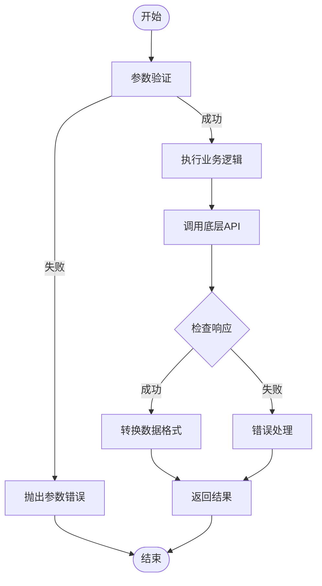
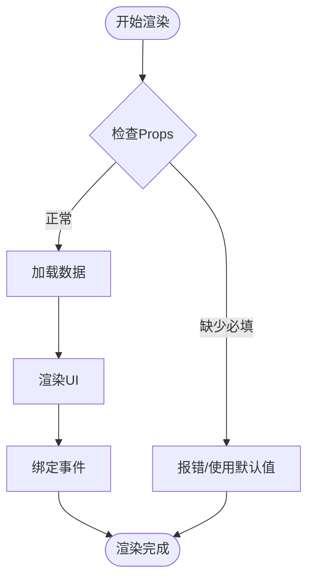
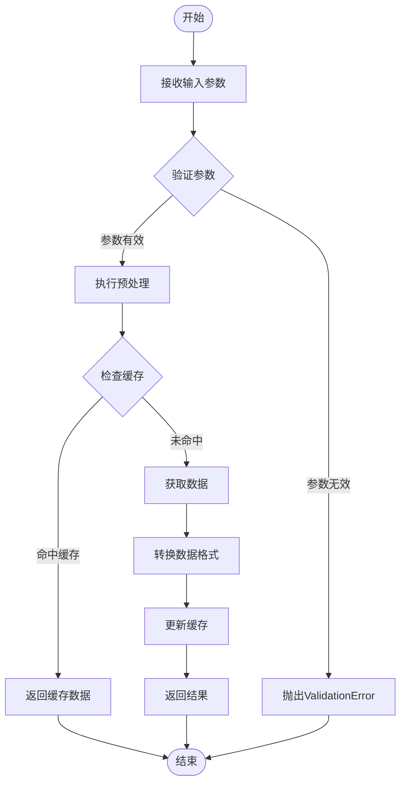
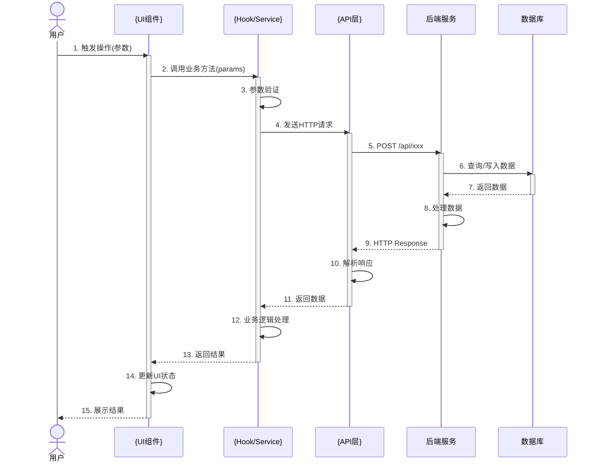

# 文档模板

本目录包含 wiki-generator 使用的所有文档模板。

---

## 模块 README 模板

```markdown
# {模块名称}

## 概述

{功能描述 - 详细版本，至少100-200字，解释模块的核心功能、解决的问题、使用场景}

### 核心能力

- {能力1}: {详细说明}
- {能力2}: {详细说明}
- {能力3}: {详细说明}

## 包含文件

| 文件 | 描述 |
|------|------|
| {文件1} | {详细用途说明，不是简单一个词} |
| {文件2} | {详细用途说明} |

## 导出内容

### 组件

| 组件 | 描述 |
|------|------|
| {组件名} | {详细描述该组件的功能和使用场景} |

### 函数/方法

| 名称 | 签名 | 描述 |
|------|------|------|
| {函数名} | {完整签名} | {详细描述功能、参数、返回值} |

### 类型定义

| 名称 | 定义 |
|------|------|
| {类型名} | {完整类型定义} |

## 架构设计

### 数据流

{描述数据如何在模块内流动，100字以上}

### 关键算法

{如果有复杂算法，描述其核心逻辑}

## 依赖关系

### 内部依赖

- [{模块名}](../{模块名}/README.md): {为什么依赖，使用了什么}

### 外部依赖

- `{包名}`: {用途说明}

## 使用示例

### 基础用法

\`\`\`typescript
{简单示例}
\`\`\`

### 高级用法

\`\`\`typescript
{复杂场景示例}
\`\`\`

## 相关文档

- [组件详情](./组件.md)
- [API接口](./API接口.md)
- [执行流程](./执行流程.md)
- [交互时序](./交互时序.md)
```

---

## 项目首页模板

```markdown
# {项目名称} Wiki

## 项目概述
{项目描述}

## 快速导航
- [文档地图](./文档地图.md)
- [快速开始](./快速开始.md)
- [架构设计](./架构设计.md)

## 模块列表
{模块列表}

## 最近更新
{更新日志}
```

---

## API 文档模板

```markdown
# {API名称}

## 概述

{API的详细描述，包括用途、使用场景、注意事项，100字以上}

## 端点列表

### {端点名称}

**基本信息**
- **函数**: `{函数名}`
- **文件**: `{文件路径}`
- **描述**: {详细描述该端点的功能}

**请求信息**
- **方法**: {GET|POST|PUT|DELETE}
- **路径**: `{完整路径}`

**请求参数**

| 参数 | 类型 | 必填 | 默认值 | 描述 |
|------|------|------|--------|------|
| {name} | {type} | {yes/no} | {default} | {详细描述，包括取值范围、约束条件} |

**响应类型**

\`\`\`typescript
{完整的响应类型定义}
\`\`\`

**错误处理**

| 错误码 | 场景 | 说明 |
|--------|------|------|
| {code} | {场景} | {说明} |

**调用示例**

\`\`\`typescript
{完整可运行的示例代码}
\`\`\`

**执行流程**


```

---

## 组件文档模板

```markdown
# {组件名称}

## 功能描述

{详细描述组件的功能、使用场景、解决的问题，100字以上}

### 适用场景

- {场景1}: {说明}
- {场景2}: {说明}

### 不适用场景

- {场景}: {原因}

## Props

| 属性 | 类型 | 必填 | 默认值 | 描述 |
|------|------|------|--------|------|
| {name} | {type} | {yes/no} | {default} | {详细描述，包括取值范围、约束条件} |

## 数据流

{描述组件的数据如何流入流出}

## 渲染流程



## 使用示例

### 基础用法

\`\`\`tsx
{简单示例}
\`\`\`

### 受控模式

\`\`\`tsx
{受控组件示例}
\`\`\`

### 与表单集成

\`\`\`tsx
{表单集成示例}
\`\`\`

## 注意事项

- {注意事项1}: {详细说明}
- {注意事项2}: {详细说明}

## 性能优化

- {优化建议}
```

---

## 执行流程图模板

```markdown
# 执行流程

## {流程名称}

### 流程概述

{流程的详细描述，包括触发条件、预期结果、关键步骤，100字以上}

### 流程图



### 详细步骤

1. **{步骤1名称}** ({参与者})
   - 输入: {输入}
   - 处理: {处理逻辑}
   - 输出: {输出}

2. **{步骤2名称}** ({参与者})
   - 输入: {输入}
   - 处理: {处理逻辑}
   - 输出: {输出}

### 异常处理

| 异常类型 | 触发条件 | 处理方式 |
|----------|----------|----------|
| {异常} | {条件} | {处理} |
```

---

## 交互时序图模板

```markdown
# 模块交互时序

## {交互场景}

### 场景描述

{交互场景的详细描述，包括触发条件、参与者、预期结果，100字以上}

### 时序图



### 交互说明

**阶段1: {阶段名称}**
- {步骤1}: {说明}
- {步骤2}: {说明}

**阶段2: {阶段名称}**
- {步骤3}: {说明}
- {步骤4}: {说明}

### 数据格式

**请求数据**:
\`\`\`json
{请求示例}
\`\`\`

**响应数据**:
\:```json
{响应示例}
\:```
```
