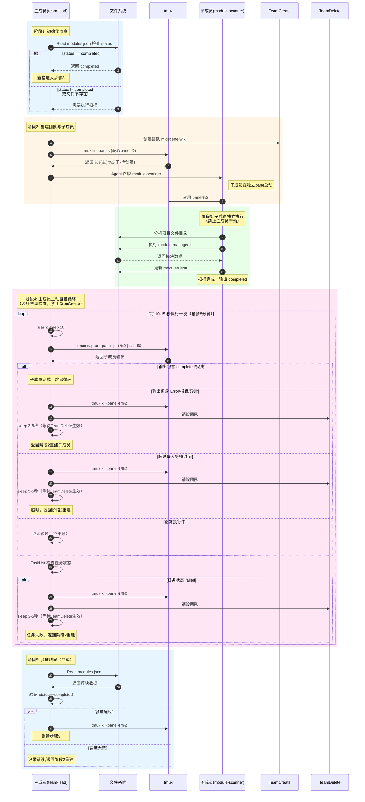

# 步骤流程时序图

## 步骤1. 初始化检查

## 步骤2. 模块扫描

```mermaid
sequenceDiagram
    autonumber
    participant TL as 主成员(team-lead)
    participant FS as 文件系统
    participant TM as tmux
    participant MS as 子成员(module-scanner)

    rect rgb(230, 245, 255)
    Note over TL: 阶段1: 初始化检查
    TL->>FS: Read modules.json 检查 status
    alt status == completed
        FS-->>TL: 返回 completed
        Note over TL: 直接进入步骤3
    else status != completed 或文件不存在
        FS-->>TL: 需要执行扫描
    end
    end

    rect rgb(255, 245, 230)
    Note over TL: 阶段2: 创建团队与子成员
    TL->>TeamCreate: 创建团队 midscene-wiki
    TL->>TM: tmux list-panes (获取pane ID)
    TM-->>TL: 返回 %1(主) %2(子-待创建)
    TL->>MS: Agent 召唤 module-scanner
    Note right of MS: 子成员在独立pane启动
    MS->>TM: 占用 pane %2
    end

    rect rgb(230, 255, 230)
    Note over MS: 阶段3: 子成员独立执行<br/>（禁止主成员干预）
    MS->>FS: 分析项目文件目录
    MS->>FS: 执行 module-manager.js
    FS-->>MS: 返回模块数据
    MS->>FS: 更新 modules.json
    Note over MS: 扫描完成，输出 completed
    end

    rect rgb(255, 230, 245)
    Note over TL: 阶段4: 主成员主动监控循环<br/>（必须主动检查，禁止CronCreate）

    loop 每 10-15 秒执行一次（最多5分钟）
        TL->>TL: Bash: sleep 10
        TL->>TM: tmux capture-pane -p -t %2 | tail -50
        TM-->>TL: 返回子成员输出

        alt 输出包含 completed/完成
            Note over TL: 子成员完成，跳出循环
        else 输出包含 Error/报错/异常
            TL->>TM: tmux kill-pane -t %2
            TL->>TeamDelete: 销毁团队
            TL->>TL: sleep 3-5秒（等待TeamDelete生效）
            Note over TL: 返回阶段2重建子成员
        else 超过最大等待时间
            TL->>TM: tmux kill-pane -t %2
            TL->>TeamDelete: 销毁团队
            TL->>TL: sleep 3-5秒（等待TeamDelete生效）
            Note over TL: 超时，返回阶段2重建
        else 正常执行中
            TL->>TL: 继续循环（不干预）
        end

        TL->>TL: TaskList 检查任务状态
        alt 任务状态 failed
            TL->>TM: tmux kill-pane -t %2
            TL->>TeamDelete: 销毁团队
            TL->>TL: sleep 3-5秒（等待TeamDelete生效）
            Note over TL: 任务失败，返回阶段2重建
        end
    end
    end

    rect rgb(230, 245, 255)
    Note over TL: 阶段5: 验证结果（只读）
    TL->>FS: Read modules.json
    FS-->>TL: 返回模块数据
    TL->>TL: 验证 status==completed
    alt 验证通过
        TL->>TM: tmux kill-pane -t %2
        Note over TL: 继续步骤3
    else 验证失败
        Note over TL: 记录错误,返回阶段2重建
    end
    end
```
